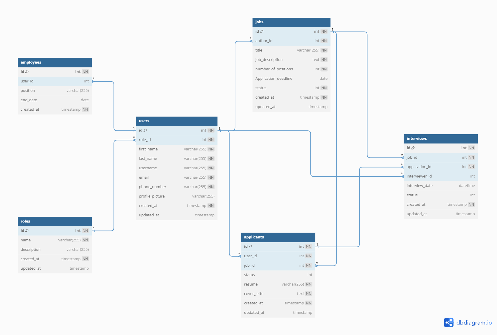

# Database Schema Documentation
This schema defines the structure of the database, providing a clear understanding of the relationships and constraints  
between different tables.

## Users Table
- **Table Name:** `users`

| Column           | Type           | Constraints                       |
|------------------|----------------|-----------------------------------|
| id               | INT            | PRIMARY KEY, NOT NULL              |
| role_id          | INT            | NOT NULL, FOREIGN KEY (roles.id)   |
| first_name       | VARCHAR(255)   | NOT NULL                          |
| last_name        | VARCHAR(255)   | NOT NULL                          |
| username         | VARCHAR(255)   | NOT NULL                          |
| email            | VARCHAR(255)   | NOT NULL                          |
| phone_number     | VARCHAR(255)   | NOT NULL                          |
| profile_picture  | VARCHAR(255)   |                                   |
| created_at       | TIMESTAMP      | NOT NULL, DEFAULT CURRENT_TIMESTAMP|
| updated_at       | TIMESTAMP      |                                   |

## Jobs Table
- **Table Name:** `jobs`

| Column                | Type           | Constraints                                |
|-----------------------|----------------|--------------------------------------------|
| id                    | INT            | PRIMARY KEY, NOT NULL                       |
| author_id             | INT            | NOT NULL, FOREIGN KEY (users.id)            |
| title                 | VARCHAR(255)   | NOT NULL                                   |
| job_description      | TEXT           | NOT NULL                                   |
| number_of_positions   | INT            | NOT NULL, DEFAULT 0                         |
| Application_deadline | DATE           |                                            |
| status                | INT            | NOT NULL, DEFAULT 1                        |
| created_at            | TIMESTAMP      | NOT NULL, DEFAULT CURRENT_TIMESTAMP         |
| updated_at            | TIMESTAMP      |                                            |

## Applicants Table
- **Table Name:** `applicants`

| Column           | Type           | Constraints                       |
|------------------|----------------|-----------------------------------|
| id               | INT            | PRIMARY KEY, NOT NULL              |
| user_id          | INT            | NOT NULL, FOREIGN KEY (users.id)   |
| job_id           | INT            | NOT NULL, FOREIGN KEY (jobs.id)    |
| status           | INT            | DEFAULT 0                         |
| resume           | VARCHAR(255)   | NOT NULL                          |
| cover_letter     | TEXT           | NOT NULL                          |
| created_at       | TIMESTAMP      | NOT NULL, DEFAULT CURRENT_TIMESTAMP|
| updated_at       | TIMESTAMP      |                                   |

## Interviews Table
- **Table Name:** `interviews`

| Column           | Type           | Constraints                                 |
|------------------|----------------|---------------------------------------------|
| id               | INT            | PRIMARY KEY, NOT NULL                        |
| job_id           | INT            | NOT NULL, FOREIGN KEY (jobs.id)              |
| application_id   | INT            | NOT NULL, FOREIGN KEY (applicants.id)        |
| interviewer_id   | INT            | FOREIGN KEY (users.id)                        |
| interview_date   | DATETIME       |                                             |
| status           | INT            | DEFAULT 1                                   |
| created_at       | TIMESTAMP      | NOT NULL, DEFAULT CURRENT_TIMESTAMP          |
| updated_at       | TIMESTAMP      |                                             |

## Employees Table
- **Table Name:** `employees`

| Column           | Type           | Constraints                       |
|------------------|----------------|-----------------------------------|
| id               | INT            | PRIMARY KEY, NOT NULL              |
| user_id          | INT            | FOREIGN KEY (users.id)             |
| position         | VARCHAR(255)   |                                   |
| end_date         | DATE           |                                   |
| created_at       | TIMESTAMP      | NOT NULL, DEFAULT CURRENT_TIMESTAMP|

## Roles Table
- **Table Name:** `roles`

| Column           | Type           | Constraints                       |
|------------------|----------------|-----------------------------------|
| id               | INT            | PRIMARY KEY, NOT NULL              |
| name             | VARCHAR(255)   | NOT NULL                          |
| description      | VARCHAR(255)   |                                   |
| created_at       | TIMESTAMP      | NOT NULL, DEFAULT CURRENT_TIMESTAMP|
| updated_at       | TIMESTAMP      |                                   |

For a more visual perspective, reference can be made to the entity relationship diagram below.

